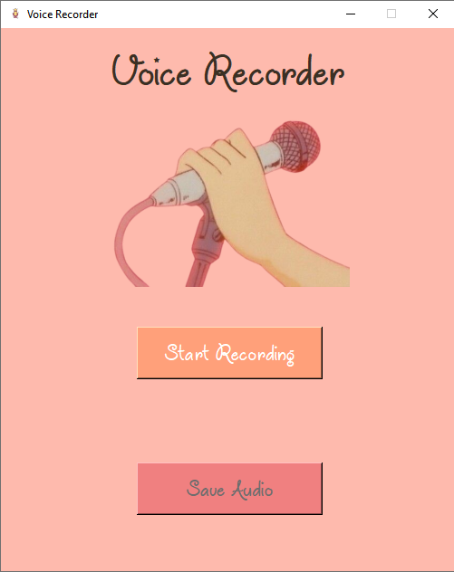
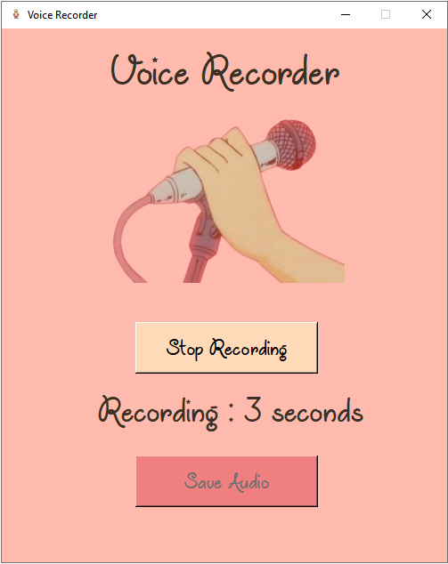
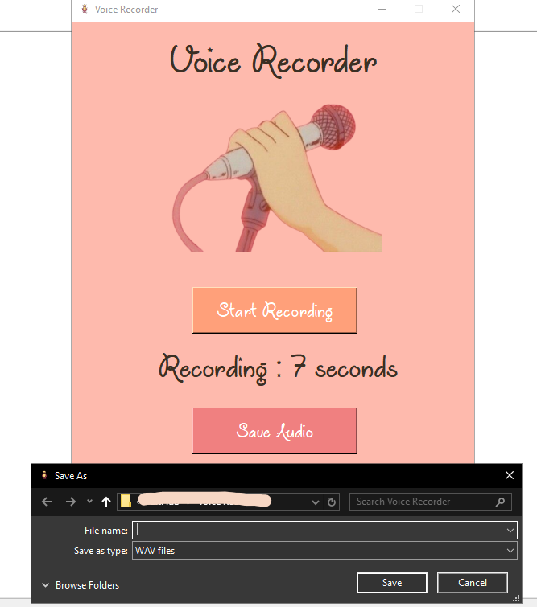

## Description
This is a simple voice recorder application built using Tkinter in Python. It allows users to start and stop audio recording, save the recorded audio as a WAV file, and displays the recording duration in real-time.

## Installation
Install the required Python packages using pip:
```bash
pip install sounddevice soundfile
```
## Screenshots
<p>
  
  
  
</p>
